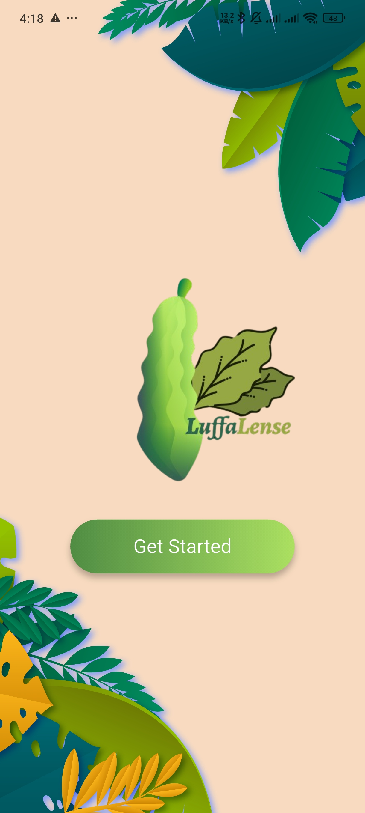
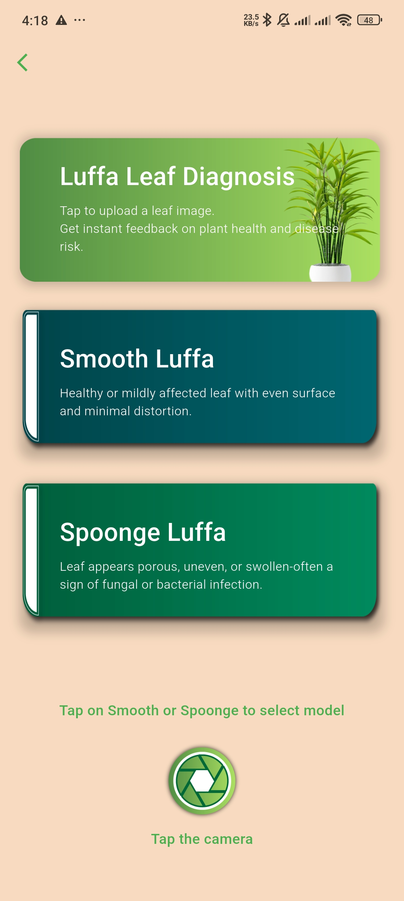
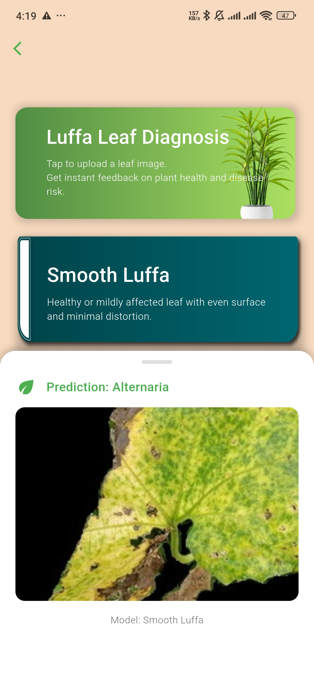

# LuffaLense

LuffaLense is a Flutter application designed for luffa plant disease detection using machine learning. It allows users to capture or select images of luffa plants and predict potential diseases using TensorFlow Lite models.

## Features

- Image capture and selection from gallery
- Disease prediction using pre-trained ML models
- User-friendly interface with animations
- Support for Android and iOS

## Project Structure

```
luffalense/
├── android/                 # Android-specific code and configurations
├── assets/                  # Static assets (images, models)
│   ├── images/              # App images and icons
│   └── tflite/              # TensorFlow Lite models
│       ├── Smooth/          # Smooth model files
│       └── Spoonge/         # Spoonge model files
├── build/                   # Build outputs
├── ios/                     # iOS-specific code and configurations
├── lib/                     # Flutter source code
│   ├── main.dart            # App entry point
│   └── second_page.dart     # Main functionality page
├── linux/                   # Linux-specific code
├── macos/                   # macOS-specific code
├── test/                    # Unit and widget tests
├── web/                     # Web-specific code
└── windows/                 # Windows-specific code
```

## Prerequisites

- Flutter SDK (^3.8.1)
- Dart SDK
- Android Studio or Xcode for mobile development

## Dependencies

- flutter: SDK
- image_picker: ^1.0.7
- http: ^1.2.0
- flutter_launcher_icons: ^0.13.1 (dev)

## How to Run

1. **Clone the repository:**
   ```
   git clone <repository-url>
   cd luffalense
   ```

2. **Install dependencies:**
   ```
   flutter pub get
   ```

3. **Run the app:**
   - For Android: `flutter run`
   - For iOS: `flutter run` (requires Xcode)
   - For web: `flutter run -d chrome`

4. **Build APK:**
   ```
   flutter build apk --debug
   ```

## Screenshots

### Home Screen


### Before Prediction


### After Prediction


## APK Download

Download the latest APK: [download](https://drive.google.com/file/d/1z7-kSG48p2qFkgVDU9feIjd81Dw49WtO/view?usp=sharing)

## Contributing

1. Fork the repository
2. Create a feature branch
3. Commit your changes
4. Push to the branch
5. Open a Pull Request

## License

This project is licensed under the MIT License.
