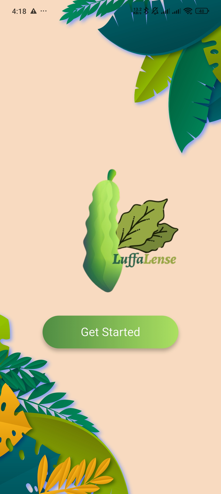
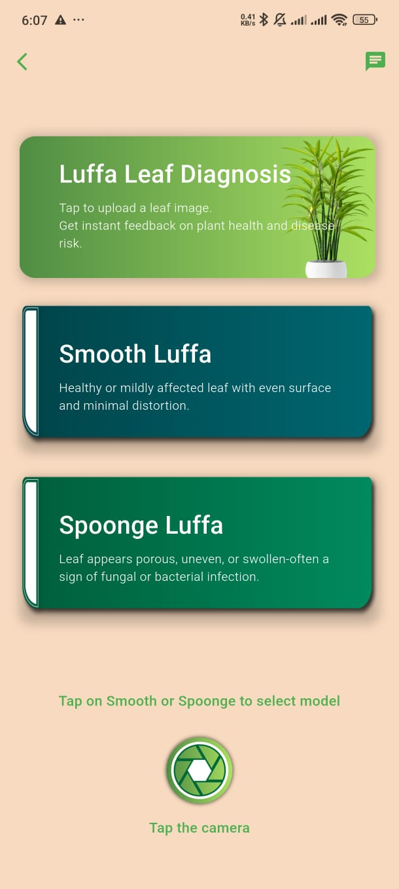
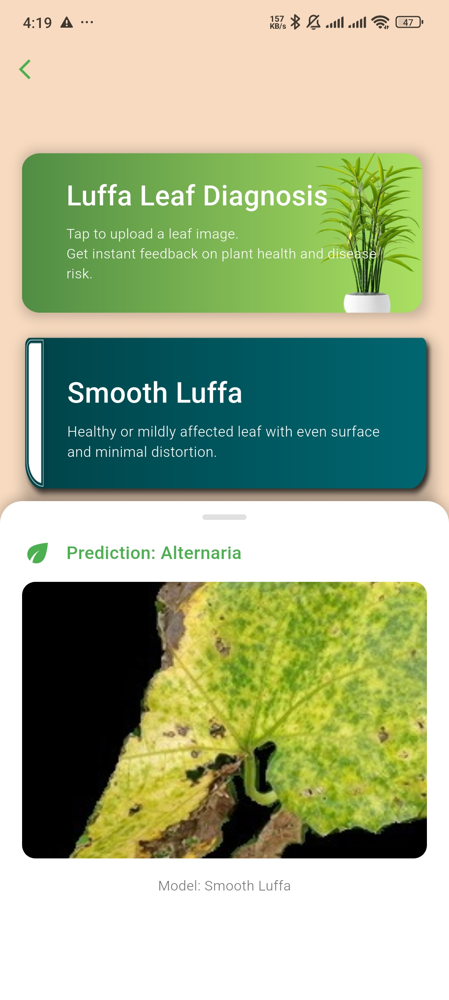
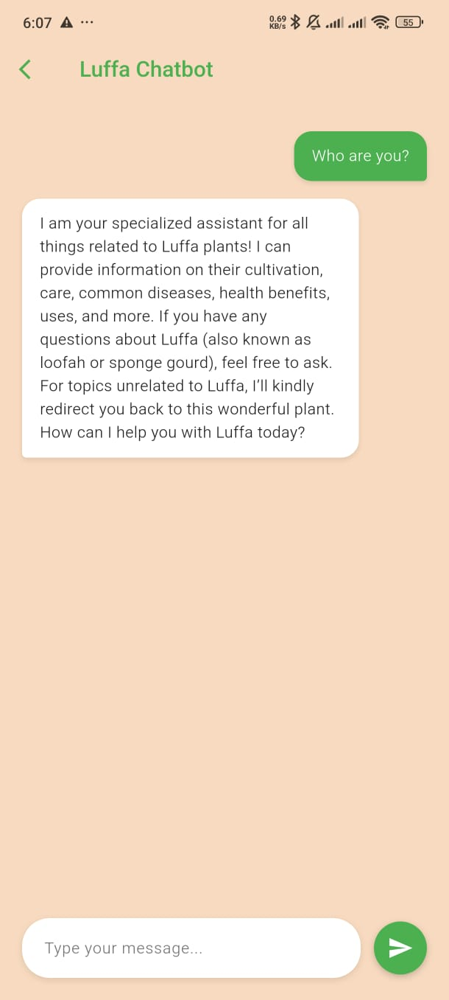

# LuffaLense

LuffaLense is a comprehensive Flutter application for luffa plant care, combining disease detection using machine learning with an AI-powered chatbot for expert advice. Users can capture or select images of luffa plants to predict potential diseases via TensorFlow Lite models, and consult a specialized chatbot for information on luffa cultivation, health, and related topics.

## Features

### Disease Detection
- **Image Capture and Selection**: Users can take photos directly from the camera or select images from their gallery for analysis.
- **Machine Learning Prediction**: Utilizes TensorFlow Lite models to analyze luffa plant images and predict potential diseases such as Smooth and Sponge varieties.
- **Real-time Results**: Provides instant disease prediction results with confidence scores and recommendations.

### AI-Powered Chatbot
- **Specialized Knowledge**: Powered by DeepSeek AI, the chatbot provides expert information specifically about luffa plants.
- **Comprehensive Coverage**: Offers advice on cultivation, disease prevention, health benefits, and general plant care.
- **Interactive Interface**: User-friendly chat interface with markdown support for rich text responses.
- **Context-Aware Responses**: Maintains conversation context and redirects queries back to luffa-related topics.

### User Experience
- **Intuitive Navigation**: Clean, modern interface with smooth animations and transitions.
- **Multi-Platform Support**: Fully functional on Android, iOS, and web platforms.
- **Offline Capabilities**: Core features work offline, with online features for AI chatbot.
- **Responsive Design**: Adapts seamlessly to different screen sizes and orientations.

## Project Structure

```
luffalense/
├── android/                 # Android-specific code and configurations
├── assets/                  # Static assets (images, models)
│   ├── images/              # App images and icons
│   └── tflite/              # TensorFlow Lite models
│       ├── Smooth/          # Smooth model files
│       └── Spoonge/         # Spoonge model files
├── build/                   # Build outputs
├── ios/                     # iOS-specific code and configurations
├── lib/                     # Flutter source code
│   ├── main.dart            # App entry point
│   └── second_page.dart     # Main functionality page
├── linux/                   # Linux-specific code
├── macos/                   # macOS-specific code
├── test/                    # Unit and widget tests
├── web/                     # Web-specific code
└── windows/                 # Windows-specific code
```

## Prerequisites

- Flutter SDK (^3.8.1)
- Dart SDK
- Android Studio or Xcode for mobile development

## Dependencies

- flutter: SDK
- image_picker: ^1.0.7
- http: ^1.2.0
- flutter_launcher_icons: ^0.13.1 (dev)

## How to Run

1. **Clone the repository:**
   ```
   git clone <repository-url>
   cd luffalense
   ```

2. **Install dependencies:**
   ```
   flutter pub get
   ```

3. **Run the app:**
   - For Android: `flutter run`
   - For iOS: `flutter run` (requires Xcode)
   - For web: `flutter run -d chrome`

4. **Build APK:**
   ```
   flutter build apk --debug
   ```

## Screenshots

### Home Screen


### Before Prediction


### After Prediction


### Chatbot Interface


## APK Download

Download the latest APK: [download apk](https://drive.google.com/file/d/1VI9QoRzFgOfd5qOdbfVHA3mTTdiQ2xD5/view?usp=sharing)

## Contributing

1. Fork the repository
2. Create a feature branch
3. Commit your changes
4. Push to the branch
5. Open a Pull Request

## License

This project is licensed under the MIT License.
